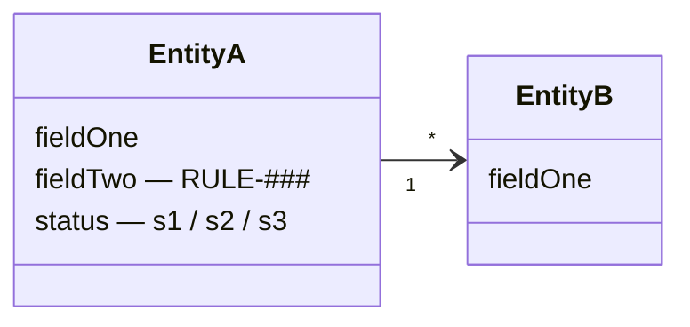
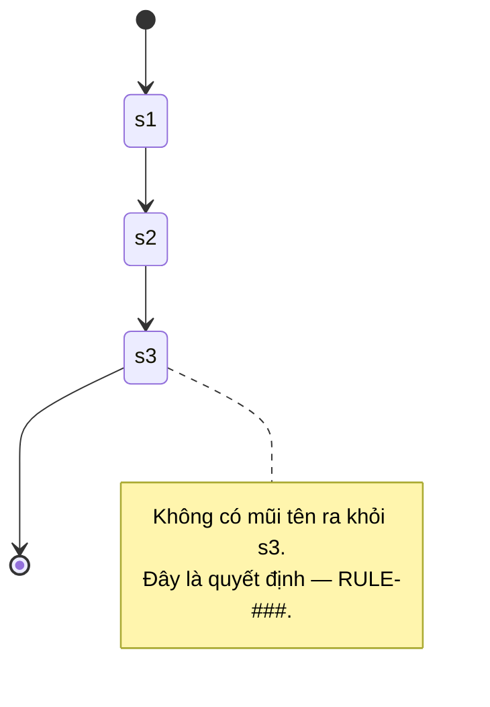

# Entity Model — <Context>

Không phải ERD. Chỉ tên, ý nghĩa, quan hệ, trạng thái. Mỗi entity có `status` phải có state diagram.

## Domain Model

## EntityA
- **Đại diện:** <một câu>
- **Trường đáng chú ý:** `fieldTwo` — giá trị theo RULE-###, không phải default.
- **Trạng thái:** s1 → s2 → s3 (xem state diagram)

## EntityB
- ...

## History
- v1 (YYYY-MM-DD): initial
