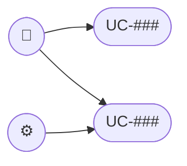

# Use Cases — <Context>

## Use Case Diagram

```mermaid
flowchart LR
  A1(["👤 <Actor 1>"])
  A2(["⚙ <Hệ thống / scheduler>"])
  UC1(["UC-### <tên>"])
  UC2(["UC-### <tên>"])
  A1 --> UC1 & UC2
  A2 --> UC2
```

## Danh sách
| ID | Tên | Actor | BR | Status |
|---|---|---|---|---|
| UC-### | ... | ... | BR-### | draft |
