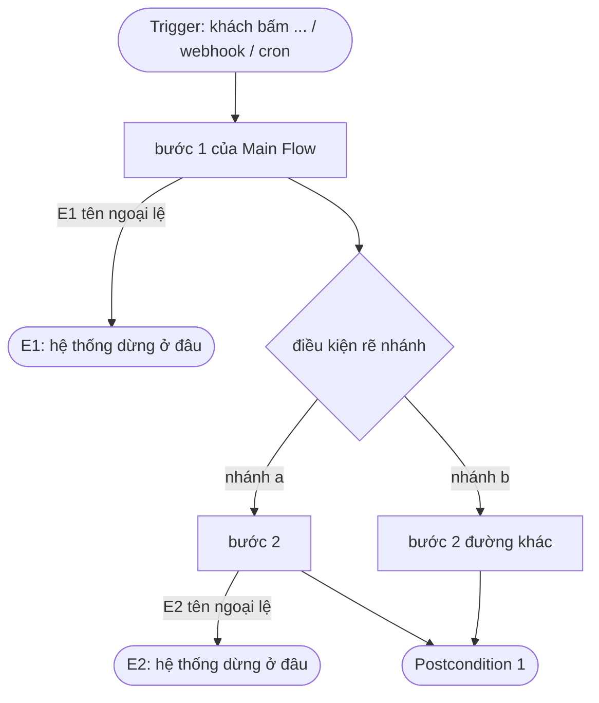

# UC-000 — Flow

Sơ đồ luồng của use case. Xem bằng mắt: VS Code `Cmd+Shift+V`, hoặc mở thẳng file trên GitHub. Không cần cài app nào.

Quy ước — cổng DoR kiểm hai vế đầu **bằng máy**:

- Mỗi ngoại lệ khai trong `## Exceptions` của UC phải xuất hiện ở đây, làm **nhãn mũi tên** — phần nằm **giữa hai dấu `|`**: `-->|E1 tên ngoại lệ|`. Thiếu = có ngoại lệ chưa vẽ đường đi.
- Mỗi nhãn ngoại lệ ở đây phải có thật trong `## Exceptions`. Không dán nhãn cho ID chưa tồn tại.
- **Chỉ nhãn giữa hai dấu `|` được đếm.** Tên node không tính, kể cả khi nó chứa `E#` — nên đặt node kết là `X1([E1: ...])` là để người đọc, không phải để qua cổng.
- Đặt id node bằng `P#` cho kết thúc thường, `X#` cho kết thúc của ngoại lệ. Id dạng `E<số>` không giả mạo được nhãn nữa, nhưng vẫn khó đọc nên cổng sẽ nhắc.

Đối chiếu trước cổng DoR:

| Trong UC | Trong sơ đồ |
|---|---|
| Actor | `subgraph <tên actor>` — chỉ cần khi có từ hai actor trở lên |
| Trigger | node đầu `S([...])`; loại trigger ghi thẳng vào tên |
| mỗi bước Main Flow | một `T#[...]` |
| mỗi Alternative Flow | một nhánh của `D#{...}`, điều kiện ghi trên mũi tên |
| mỗi Exception | mũi tên `\|E# ...\|` dẫn tới `X#([E#: ...])` |
| mỗi Postcondition | một node kết `P#([...])` |

Nhiều bước cùng dẫn về một Postcondition thì trỏ chung một node — đừng nhân bản node kết.
