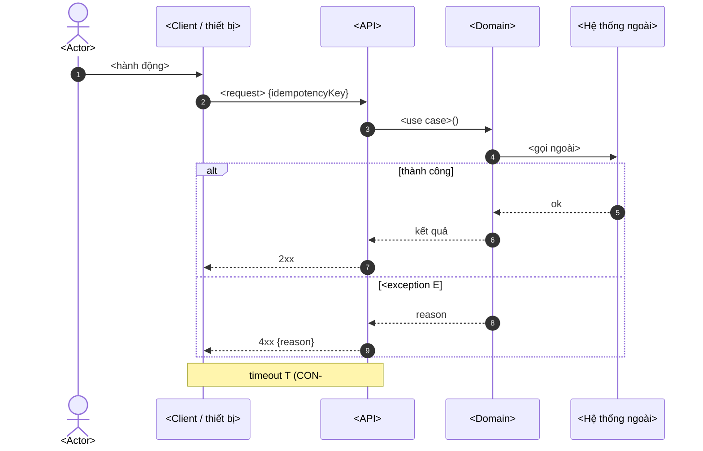

# UC-000 — Sequence

Chỉ tạo khi UC có ranh giới mạng hoặc hệ thống ngoài. Vẽ timeout, retry, idempotency — thứ BPMN không nói rõ.

```mermaid
sequenceDiagram
  autonumber
  actor K as <Actor>
  participant C as <Client / thiết bị>
  participant API as <API>
  participant D as <Domain>
  participant X as <Hệ thống ngoài>
  K->>C: <hành động>
  C->>API: <request> {idempotencyKey}
  API->>D: <use case>()
  D->>X: <gọi ngoài>
  alt thành công
    X-->>D: ok
    D-->>API: kết quả
    API-->>C: 2xx
  else <exception E#>
    D-->>API: reason
    API-->>C: 4xx {reason}
  end
  Note over C,API: timeout T (CON-###) → E#. Request đến muộn bị bỏ nhờ idempotencyKey.
```
