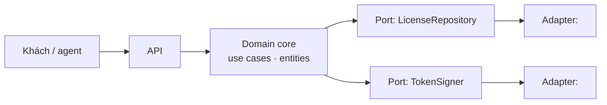

# Architecture — C4 Context/Container + Hexagonal

Tạo khi có ADR đầu tiên chạm kiến trúc tổng. Cập nhật khi ADR đổi.

Quy tắc: domain không biết DB/HTTP/provider. AI được viết lại adapter; đổi domain phải có UC/RULE.
