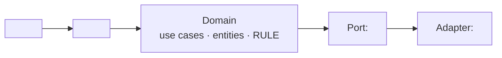

# Architecture — the project's technical constitution

**Status:** draft
**Last updated:** ___

> The five requirement layers (Direction · BR · UC · Entity · AC) answer *why · who does what · which
> concepts · how we know it is right*. **No layer answers *built with what · runs where · called by whom*.**
> This file is that slot. It is written ONCE for the whole project and edited when an ADR touches it;
> every UC's `design.md` must check back against it.
>
> The real case behind this file: a UC went the whole way round, passed the DoR gate, and then the design
> described an architecture **directly opposed** to the brief — and nobody saw it for two days, because
> every document was internally consistent. The failure was not a check measuring wrongly; it was **an
> area no check was allowed to look at**.
>
> `design-check.sh` goes red while this file still contains `<...>`. Cannot decide yet? Write `___`
> **together with a line in the BR's `## Open Questions`** — `___` is a valid answer, `<...>` is not.

## Stack
<language · runtime · backbone libraries. With the REASON — "because we already know it" is a real
reason, write exactly that; what is not allowed is leaving it empty and letting each UC pick its own.>

## Runs where
<the customer's machine · our own server · CI · the customer's machine. And: where sensitive data sits
while it runs, and who can read it.>

<!-- The value of this section is NOT "catching contradictions" — do not go hunting for them. The value
     is being FORCED TO WRITE THE SEAM DOWN. A false contradiction dissolves the moment it is written;
     a real one does not. Both outcomes are a gain, and nobody knows in advance which one it will be.

     Real case (runxops). Two sentences that read as opposites in isolation:
       CON-002  "anything touching eBay must run on a machine with Multilogin"
       ADR-001  "the server never touches a customer's disk"
     Written into the same section, it becomes clear they are about TWO DIFFERENT SUBJECTS — one is about
     where a PERSON does manual work, the other about where CODE runs. The contradiction dissolves.
     Without this section that false contradiction survives until somebody at step ⑪ resolves it their
     own way, silently. -->

## Callers
<a person typing a command · a schedule · another system calling in · an agent. A concrete name, not
"the user".>

## Boundaries
<what the domain may not know; what an adapter may know. Draw it so it is easy to check against:>

## Forbidden
<the things this project does NOT do, with reasons. This is the most often empty section and the most
expensive one: a prohibition that is never written down leaves nobody, six months later, able to tell
"not built yet" from "deliberately not built".>

**Any line that names a source must quote it verbatim**, like this:

- no <the forbidden thing> — source: `BR-001` · verbatim: "<copy the source's exact words>" — because <reason>
  - From: YYYY-MM-DD · State: active

<!-- The second line (`From:` · `State:`) was added in 4.2.0, and it is NOT procedure for its own sake.

     The runxops case in the block below ends with: "those are TWO prohibitions from two moments, and the
     later one is stricter and swallows something In Scope currently allows". That sentence can only be
     said WHEN THERE ARE DATES. Without them the two lines sit side by side, both read fine, and nobody —
     the owner included — can reconstruct which came first. It is the one thing in this whole document set
     that CANNOT BE REBUILT: a file's layout can always be rearranged, a prohibition that lost its date is
     gone for good.

     When it stops applying: `State: superseded by <ID> from YYYY-MM-DD` — do NOT delete the line. Deleting
     a prohibition deletes the evidence that it was ever considered, and six months later nobody can tell
     "not built yet" from "deliberately not built". -->

<!-- Why quoting verbatim is required instead of just naming the ID (real case, runxops). One line here read:
       "No automation running INSIDE a Multilogin session. BR-001 Out of Scope: tried it, risk of a dead account"
     BR-001 actually forbids running OUTSIDE the session; its In Scope explicitly ALLOWS running inside.
     So that line both INVERTED a prohibition and attached a source to a sentence the source never said.

     It read perfectly. It sat in br.md from the start, passed br-check green, passed a three-role adversarial
     pass, passed the DoR gate — no check caught it, because NO CHECK READS THE BRIEF AND THE BR AT THE SAME
     TIME. `design-check` cannot catch it either: it checks that an ID EXISTS, not that the ID SAYS what is
     attached to it, and `BR-001` does exist.

     What exposed it was THE ACT OF COPYING VERBATIM: going to fetch the exact sentence shows immediately that
     it says "outside", not "inside". `design-check` warns (does not block) when a line names an ID without a
     "verbatim:".

     And that case taught one more thing: after the fix it turned out NOT to be a transcription error — they
     were TWO prohibitions from two moments, the later one stricter, swallowing something In Scope allowed.
     So when two sources clash, do not pick one for the owner: write both down here, add a line to
     ## Open Questions, and let the owner decide. -->

## Settled from brief
<The destination of every `→ moved to: architecture.md` line in the `## Dropped from brief` section of the
slices' `br.md` (`specs/<core|craft>/br-###/br.md`). One line each: what the brief asks · what was decided
here · and if it differs from the brief, WHY.
An empty section while a br.md still points here means the parcel was sent and nobody signed for it.>
