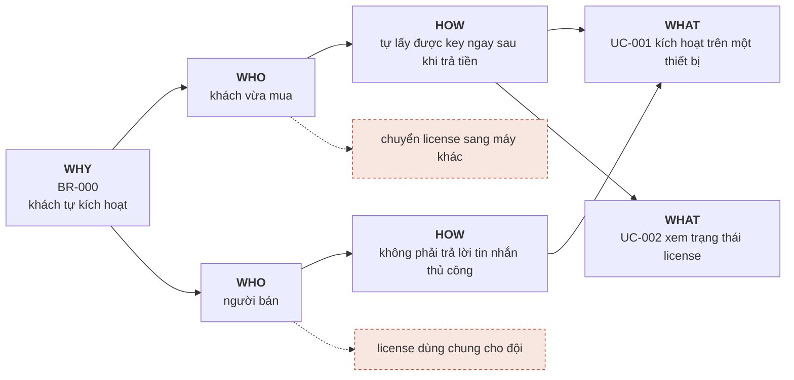
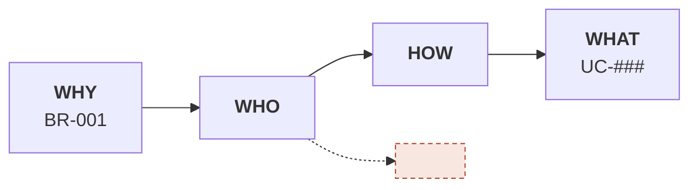

# Business Requirements

Mỗi BR một mục. Impact Map ngay dưới BR. Success Metric để trống cho tới khi có cách đo thật.

Chưa biết bắt đầu từ đâu → `/sdd-solo:intake` (phỏng vấn từng câu, hoặc chuyển brief của
agent khác thành BR chuẩn). Viết xong, kiểm bằng máy:

```bash
.sdd/scripts/br-check.sh BR-001
```

Quy tắc quan trọng nhất của tầng này: **`___` là câu trả lời hợp lệ, số bịa thì không.**
Chưa đo được thì để `___` và ghi cách sẽ đo. Một con số đẹp không nguồn ở đây sẽ được cả
bộ 24 kiểm ở cổng DoR bảo vệ rất kỷ luật suốt phần đời còn lại của dự án.

---

# BR-000: Khách tự kích hoạt plugin đã mua, không cần hỗ trợ thủ công

> **ĐÂY LÀ MẪU.** Đọc để thấy một BR viết đủ trông thế nào, rồi viết `BR-001` ở dưới.
> `br-check.sh` bỏ qua `BR-000`. Xoá cả mục này khi không cần nữa.

## Metadata
- **Status:** approved
- **Nguồn:** phỏng vấn (/sdd-solo:intake)
- **Target release:** v1
- **Last updated:** 2026-01-15

## Background
Tháng 12/2025 bán được 41 đơn plugin. 23 đơn trong đó nhắn tin riêng cho người bán để xin
kích hoạt, trung bình 2 lượt qua lại mỗi đơn (đếm tay trong inbox, tuần 08–14/12). Người bán
chỉ trả lời được vào buổi tối, nên khách mua ngoài giờ phải chờ tới hôm sau mới dùng được
thứ đã trả tiền.

## Goal
Khách mua plugin kích hoạt được trên thiết bị của mình mà không cần nhắn tin cho người bán.

## Success Metrics
- Tỷ lệ đơn kích hoạt xong không qua hỗ trợ: ___ → ___ (đo qua: đếm tay đơn thanh toán so với thread hỗ trợ, mỗi thứ Hai · baseline tháng ___)
- Số lượt nhắn tin xin kích hoạt mỗi tháng: ___ (đo qua: đếm thread trong inbox, cùng lúc trên)

Số để `___` vì chưa có analytics. Cách đo thì **không** được để trống — đó là thứ quyết định
metric này có thật hay chỉ là câu nói hay.

## In Scope (v1)
- Sinh và gửi license key ngay khi thanh toán thành công
- Kích hoạt key trên một thiết bị
- Khách tự xem trạng thái license của mình

## Out of Scope
- Chuyển license sang thiết bị khác (→ BR sau, khi đo được có bao nhiêu người hỏi)
- Một license dùng chung cho cả đội
- Kích hoạt hoàn toàn offline, không cần mạng lần đầu
- Tự động hoàn tiền khi kích hoạt lỗi — v1 vẫn làm tay

## Related Use Cases
- UC-001: Kích hoạt license trên một thiết bị
- UC-002: Xem trạng thái license

## Constraints
- **CON-001 Technical:** hosting chia sẻ, không chạy được job nền quá 30 giây.
- **CON-002 Regulatory:** bản ghi thanh toán phải giữ 10 năm theo quy định kế toán — khách huỷ cũng không xoá.
- **CON-003 Timing:** người bán chỉ có buổi tối để xử lý, nên mọi việc cần tay người phải gộp một lần mỗi ngày.

## Impact Map


Hai nhánh đứt là Out of Scope. Impact Map không có nhánh đứt nào nghĩa là chưa map gì cả —
chỉ là đường thẳng từ Goal xuống danh sách việc đã định làm sẵn.

## Adversarial pass
- Ngày chạy: 2026-01-14 · Session mới: [x]
- Vai người trả tiền:
  - Q1 Không làm gì thì mất bao nhiêu? → 23 đơn × 2 lượt nhắn × ~6 phút ≈ 4,6 giờ/tháng của người bán → Background
  - Q2 Baseline "41 đơn" lấy ở đâu? → đếm tay trong trang đơn hàng, tuần 08–14/12 → Background
- Vai người sẽ vận hành nó mãi:
  - Q3 Key gửi đi mà email khách sai thì ai xử? → Open Question (quyết định tạm: người bán gửi lại tay)
  - Q4 "Chuyển license sang máy khác" ở Out of Scope — khách đổi máy sẽ nhắn tin, tức đúng việc BR này định bỏ? → Open Question
- Vai người hoài nghi:
  - Q5 Có cách nào không xây phần mềm không? → có: gửi key tay theo lô mỗi tối. Vẫn chọn xây vì CON-003 giới hạn người bán một lần/ngày, khách mua sáng phải chờ tới tối → Background
  - Q6 Đây là BR hay là giải pháp viết ngược? → là BR: goal nói *khách dùng được thứ đã trả tiền ngay*, không nói phải làm bằng license key

## Open Questions
- [ ] Một license cho mấy thiết bị? (quyết định tạm: 1, cho tới khi có khách hỏi)
- [ ] Key hết hạn theo thời gian hay vĩnh viễn? (quyết định tạm: vĩnh viễn ở v1)
- [ ] Email khách sai thì ai gửi lại key? (quyết định tạm: người bán gửi tay)
- [ ] Khách đổi máy sẽ nhắn tin — có mâu thuẫn với Out of Scope không? (quyết định tạm: chấp nhận ở v1, đo số lần)

## History
- v1 (2026-01-15): initial

---

# BR-001: <Tên business requirement>

## Metadata
- **Status:** draft | approved | in-progress | done
- **Nguồn:** phỏng vấn (/sdd-solo:intake) | brief `<đường/dẫn>` | tự viết
- **Target release:** v___
- **Last updated:** YYYY-MM-DD

## Background
<Vì sao có requirement này — bối cảnh kinh doanh, phản hồi khách, ràng buộc bên ngoài.
Khẳng định nào không có số hoặc nguồn thì đưa xuống Open Questions, đừng viết ở đây như sự thật>

## Goal
<Một câu. Tránh "tối ưu", "cải thiện", "nâng cao" nếu Success Metrics chưa có số>

## Success Metrics
- <Metric 1>: ___ → ___   (đo qua: <cách đo thật, kể cả đếm tay> · baseline tháng ___)
- <Metric 2>: ___          (đo qua: <cách đo thật>)

## In Scope (v___)
- ...

## Out of Scope
- <Những thứ cố ý không làm — mỗi dòng nên là một nhánh trên Impact Map không nối về Goal>

<!-- Mục dưới CHỈ có khi BR chuyển từ brief. Viết từ phỏng vấn thì xoá đi —
     không loại cái gì khỏi brief thì không có gì để ghi. -->
## Đã loại khỏi brief
- <mục trong brief> — <lý do không đưa vào spec>

## Related Use Cases
- UC-###: ...

## Constraints
- **CON-001 Technical:** ...
- **CON-002 Regulatory:** ...
- **CON-003 Timing/SLA:** ...

## Impact Map


## Adversarial pass
<`/sdd-solo:adversarial BR-001` điền vào đây — ba vai: người trả tiền, người vận hành mãi, người hoài nghi>

## Open Questions
- [ ] ...

## History
- v1 (YYYY-MM-DD): initial
