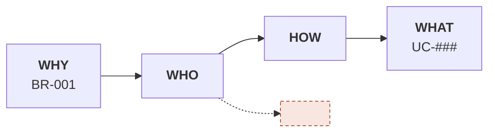

# Business Requirements

Mỗi BR một mục. Impact Map ngay dưới BR. Success Metric để trống cho tới khi có cách đo thật.

---

# BR-001: <Tên business requirement>

## Metadata
- **Status:** draft | approved | in-progress | done
- **Target release:** v___
- **Last updated:** YYYY-MM-DD

## Background
<Vì sao có requirement này — bối cảnh kinh doanh, phản hồi khách, ràng buộc bên ngoài>

## Goal
<Một câu. Tránh "tối ưu", "cải thiện" nếu chưa có metric>

## Success Metrics
- <Metric 1>: ___ → ___   (đo qua: ________ · baseline tháng ___)
- <Metric 2>: ___          (đo qua: ________)

## In Scope (v___)
- ...

## Out of Scope
- <Những thứ cố ý không làm — mỗi dòng nên là một nhánh trên Impact Map không nối về Goal>

## Related Use Cases
- UC-###: ...

## Constraints
- **CON-001 Technical:** ...
- **CON-002 Regulatory:** ...
- **CON-003 Timing/SLA:** ...

## Impact Map

## Open Questions
- [ ] ...

## History
- v1 (YYYY-MM-DD): initial
