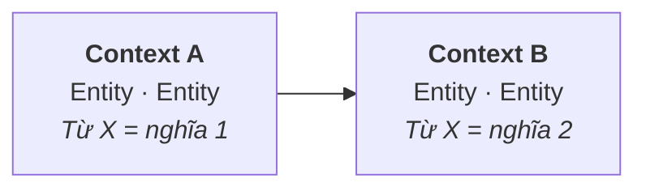

# Context Map

Tạo khi có ≥ 2 bounded context. Mũi tên ghi thứ đi qua ranh giới. Từ nào đổi nghĩa khi qua ranh giới → ghi vào glossary.

## Quan hệ
| Từ | Context | Nghĩa |
|---|---|---|
| ... | A | ... |
| ... | B | ... |
