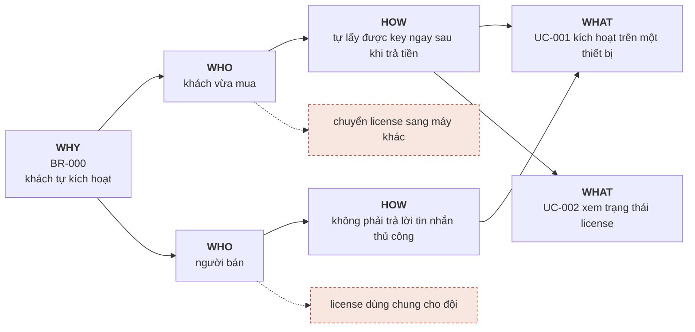

<!-- Một lát = một thư mục `specs/<core|nghề>/br-###/` gồm `br.md` (file này) · `evidence.md`
     (chứng cứ dài, mở khi tranh chấp) · `use-cases/UC-###-slug/`. Từ 7.0 không còn `specs/br.md`
     gộp: mỗi BR một file, đúng một lát trong `specs/vision.md`.

     ĐÂY LÀ MẪU. Đọc để thấy một BR viết đủ trông thế nào, rồi `/sdd-solo:intake` tạo `br-001/`
     ở đúng nghề. `br-check.sh` bỏ qua `BR-000`. Xoá cả thư mục này khi không cần nữa.

     Quy tắc quan trọng nhất của tầng này: `___` là câu trả lời hợp lệ, số bịa thì không.
     Chưa đo được thì để `___` và ghi cách sẽ đo. Một con số đẹp không nguồn ở đây sẽ được cả
     bộ 24 kiểm ở cổng DoR bảo vệ rất kỷ luật suốt phần đời còn lại của dự án.
     Kiểm bằng máy: .sdd/scripts/br-check.sh BR-001 -->

# BR-000: Khách tự kích hoạt plugin đã mua, không cần hỗ trợ thủ công

## Metadata
- **Status:** approved
- **Lát:** core · lát 1 "khách tự kích hoạt" — tên lát có ở bảng `## Nghề và lát` của `specs/vision.md`
- **Nguồn:** phỏng vấn (/sdd-solo:intake)
- **Target release:** v1
- **Last updated:** 2026-01-15

## Background
Tháng 12/2025 bán được 41 đơn plugin. 23 đơn trong đó nhắn tin riêng cho người bán để xin
kích hoạt, trung bình 2 lượt qua lại mỗi đơn (đếm tay trong inbox, tuần 08–14/12). Người bán
chỉ trả lời được vào buổi tối, nên khách mua ngoài giờ phải chờ tới hôm sau mới dùng được
thứ đã trả tiền.

**Vì sao vẫn xây:** có cách không-phần-mềm — gửi key tay theo lô mỗi tối. Bỏ vì CON-003 giới hạn
người bán một lần mỗi ngày, nên khách mua buổi sáng vẫn phải chờ tới tối, tức không giải quyết
được đúng chỗ đau. Hai phương án khác đã cân: thuê người trực (không đủ đơn để trả lương) và bán
qua sàn có sẵn cơ chế cấp key (mất 20% doanh thu).

## Goal
Khách mua plugin kích hoạt được trên thiết bị của mình mà không cần nhắn tin cho người bán.

## Success Metrics
- Tỷ lệ đơn kích hoạt xong không qua hỗ trợ: ___ → ___ (đo qua: đếm tay đơn thanh toán so với thread hỗ trợ, mỗi thứ Hai · baseline tháng ___)
- Số lượt nhắn tin xin kích hoạt mỗi tháng: ___ (đo qua: đếm thread trong inbox, cùng lúc trên)

Số để `___` vì chưa có analytics. Cách đo thì **không** được để trống — đó là thứ quyết định
metric này có thật hay chỉ là câu nói hay.

## In Scope (v1)
- Sinh và gửi license key ngay khi thanh toán thành công
- Kích hoạt key trên một thiết bị
- Khách tự xem trạng thái license của mình

## Out of Scope
- Chuyển license sang thiết bị khác → lát 2 "đổi máy", mở khi đo được có bao nhiêu người hỏi
- Một license dùng chung cho cả đội → mở lại khi có khách đội đầu tiên
- Kích hoạt hoàn toàn offline, không cần mạng lần đầu — cố ý thu hẹp — chủ dự án chốt 2026-01-15
- Tự động hoàn tiền khi kích hoạt lỗi — v1 vẫn làm tay → mở lại khi quá 5 ca/tháng

<!-- Mỗi dòng Out of Scope nói nó đi ĐÂU: `→ lát ___` (một lát trong vision.md) hoặc `→ mở lại khi ___`.
     Dòng trùng với một điều ở `## Không thu hẹp` của vision.md thì br-check đỏ — trừ khi ghi
     `cố ý thu hẹp — chủ dự án chốt YYYY-MM-DD`: thu hẹp là quyết định của chủ dự án, có ngày. -->

## Related Use Cases
| UC | Tên | Actor | BR | Status |
|---|---|---|---|---|
| UC-001 | Kích hoạt license trên một thiết bị | khách vừa mua | BR-000 | draft |
| UC-002 | Xem trạng thái license | khách | BR-000 | draft |

<!-- Bảng này là bảng UC của lát (7.0 — thay use-cases.md của context). Cột Status do
     pass.sh gate/close/deprecate tự ghi; /sdd-solo:state gợi UC tiếp theo từ đây. -->

## Constraints
- **CON-001 Technical:** hosting chia sẻ, không chạy được job nền quá 30 giây.
  - Từ: 2026-03-14 · Biết qua: bảng giá gói Business, mục "Execution limits" · Kiểm lại: khi đổi gói hosting · Trạng thái: đúng
- **CON-002 Regulatory:** bản ghi thanh toán phải giữ 10 năm theo quy định kế toán — khách huỷ cũng không xoá.
  - Từ: 2026-03-14 · Biết qua: Luật Kế toán 2015, Điều 41 · Kiểm lại: khi luật kế toán sửa · Trạng thái: đúng
- **CON-003 Timing:** người bán chỉ có buổi tối để xử lý, nên mọi việc cần tay người phải gộp một lần mỗi ngày.
  - Từ: 2026-03-14 · Biết qua: chính người bán nói trong buổi intake · Kiểm lại: khi có người thứ hai phụ trách · Trạng thái: đúng

<!-- Vì sao CON có `Kiểm lại` mà RULE/ADR không có.

     CON-### KHÔNG phải một quyết định. Không cái nào ở trên do ta chọn, và không cái nào
     chọn khác được. Đó là SỰ THẬT VỀ THẾ GIỚI đang ràng buộc quyết định — khác loại với
     RULE (ta đặt ra) và ADR (ta chọn phương án).

     Khác loại thì hỏng theo cách khác:
       · Một QUYẾT ĐỊNH hết đúng khi LÝ DO của nó hết đúng — mà lý do nằm ngay trong file,
         đọc lại là thấy.
       · Một RÀNG BUỘC hết đúng khi THẾ GIỚI đổi — và thế giới đổi thì KHÔNG CÓ GÌ TRONG
         REPO ĐỘNG ĐẬY CẢ.

     Đổi hosting năm 2028: CON-001 lặng lẽ thành sai. Mọi UC dựng quanh nó vẫn đứng nguyên,
     vẫn qua mọi phép kiểm, vẫn đọc trôi chảy. Không dòng đỏ nào, vì không phép kiểm nào
     biết ngoài đời vừa xảy ra chuyện gì. Cùng lớp "báo xanh sai", nhưng nguồn nằm ngoài repo.

     `Kiểm lại:` là thứ duy nhất biến chuyện đó thành một dòng CÓ THỂ QUÁ HẠN — tức đo được.
     Nó không cần là ngày; "khi đổi gói hosting" là một mốc hợp lệ và thường tốt hơn ngày.
     `Biết qua:` trả lời "làm sao ta biết điều này đúng" — năm năm sau đó là thứ cho phép
     đi kiểm lại, thay vì phải tin. -->

<!-- Định dạng dòng thứ hai là hợp đồng với `decisions.sh`: bốn nhãn `Từ:` `Biết qua:`
     `Kiểm lại:` `Trạng thái:` ngăn bằng ` · `, nằm trên MỘT dòng, thụt vào dưới CON.
     Đổi nhãn thì sổ tra không đọc được nữa. Hết hiệu lực thì viết
     `Trạng thái: hết đúng từ YYYY-MM-DD` — đừng xoá dòng CON, xoá là mất dấu vết. -->

## Impact Map

Hai nhánh đứt là Out of Scope. Impact Map không có nhánh đứt nào nghĩa là chưa map gì cả —
chỉ là đường thẳng từ Goal xuống danh sách việc đã định làm sẵn.

## Adversarial pass
- Ngày chạy: 2026-01-14 · Session mới: [x]
- Vai người trả tiền:
  - Q1 Không làm gì thì mất bao nhiêu? → 23 đơn × 2 lượt nhắn × ~6 phút ≈ 4,6 giờ/tháng của người bán → Background
  - Q2 Baseline "41 đơn" lấy ở đâu? → đếm tay trong trang đơn hàng, tuần 08–14/12 → Background
- Vai người sẽ vận hành nó mãi:
  - Q3 Key gửi đi mà email khách sai thì ai xử? → Open Question (quyết định tạm: người bán gửi lại tay)
  - Q4 "Chuyển license sang máy khác" ở Out of Scope — khách đổi máy sẽ nhắn tin, tức đúng việc BR này định bỏ? → Open Question
- Vai người hoài nghi:
  - Q5 Có cách nào không xây phần mềm không? → có: gửi key tay theo lô mỗi tối. Vẫn chọn xây vì CON-003 giới hạn người bán một lần/ngày, khách mua sáng phải chờ tới tối → Background
  - Q6 Đây là BR hay là giải pháp viết ngược? → là BR: goal nói *khách dùng được thứ đã trả tiền ngay*, không nói phải làm bằng license key

## Open Questions
- [ ] Một license cho mấy thiết bị? (quyết định tạm: 1, cho tới khi có khách hỏi)
- [ ] Key hết hạn theo thời gian hay vĩnh viễn? (quyết định tạm: vĩnh viễn ở v1)
- [ ] Email khách sai thì ai gửi lại key? (quyết định tạm: người bán gửi tay)
- [ ] Khách đổi máy sẽ nhắn tin — có mâu thuẫn với Out of Scope không? (quyết định tạm: chấp nhận ở v1, đo số lần)

## History
- v1 (2026-01-15): initial
