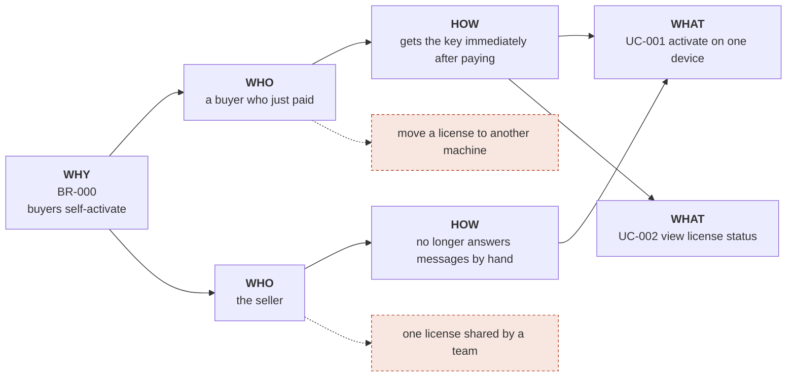

<!-- One slice = one folder `specs/<core|craft>/br-###/` holding `br.md` (this file) · `evidence.md`
     (the long evidence, opened when something is disputed) · `use-cases/UC-###-slug/`. Since 7.0 there
     is no combined `specs/br.md`: one file per BR, exactly one slice in `specs/vision.md`.

     THIS IS A SAMPLE. Read it to see what a fully written BR looks like, then `/sdd-solo:intake` creates
     `br-001/` in the right craft. `br-check.sh` skips `BR-000`. Delete this whole folder when you no
     longer need it.

     The most important rule of this layer: `___` is a valid answer, an invented number is not.
     Cannot measure it yet? Leave `___` and write down how you will measure. A pretty number with no
     source here will be defended very diligently by all 24 DoR gate checks for the rest of the project's life.
     Machine check: .sdd/scripts/br-check.sh BR-001 -->

# BR-000: Buyers activate the plugin they paid for, with no manual support

## Metadata
- **Status:** approved
- **Slice:** core · slice 1 "self-activation" — the slice name appears in the `## Crafts and slices` table of `specs/vision.md`
- **Source:** interview (/sdd-solo:intake)
- **Target release:** v1
- **Last updated:** 2026-01-15

## Background
December 2025 sold 41 plugin orders. 23 of those messaged the seller directly to ask for activation,
on average 2 round trips per order (hand-counted in the inbox, week of 08–14 Dec). The seller can only
reply in the evening, so a buyer who purchases outside those hours waits until the next day to use
what they already paid for.

**Why still build:** there is a non-software route — send keys by hand in a batch every evening. Dropped
because CON-003 limits the seller to once a day, so a morning buyer still waits until evening, which does
not solve the actual pain. Two other options were weighed: hiring someone to staff it (not enough orders
to pay a wage) and selling through a marketplace that issues keys (loses 20% of revenue).

## Goal
A buyer can activate the plugin on their own device without messaging the seller.

## Success Metrics
- Share of orders activated with no support contact: ___ → ___ (measured by: hand-counting paid orders against support threads, every Monday · baseline month ___)
- Activation request messages per month: ___ (measured by: counting threads in the inbox, at the same time)

The numbers are `___` because there is no analytics yet. The way of measuring may **not** be left empty —
that is what decides whether the metric is real or just a nice sentence.

## In Scope (v1)
- Generate and send the license key as soon as payment succeeds
- Activate a key on one device
- The buyer can see their own license status

## Out of Scope
- Moving a license to another device → slice 2 "device change", opens once we can measure how many people ask
- One license shared across a team → reopen when the first team customer appears
- Fully offline activation, no network needed the first time — deliberately narrowed — owner decided 2026-01-15
- Automatic refunds when activation fails — v1 still does it by hand → reopen when it exceeds 5 cases/month

<!-- Every Out of Scope line says where it GOES: `→ slice ___` (a slice in vision.md) or `→ reopen when ___`.
     A line that repeats something in `## Do not narrow` of vision.md makes br-check red — unless it says
     `deliberately narrowed — owner decided YYYY-MM-DD`: narrowing is the owner's decision, and it is dated. -->

## Related Use Cases
| UC | Name | Actor | BR | Status |
|---|---|---|---|---|
| UC-001 | Activate a license on one device | a buyer who just paid | BR-000 | draft |
| UC-002 | View license status | buyer | BR-000 | draft |

<!-- This is the slice's UC table (7.0 — it replaces a context's use-cases.md). The Status column is written
     by pass.sh gate/close/deprecate; /sdd-solo:state suggests the next UC from here. -->

## Constraints
- **CON-001 Technical:** shared hosting, cannot run a background job longer than 30 seconds.
  - From: 2026-03-14 · Known via: the Business plan price page, "Execution limits" · Review on: when the hosting plan changes · State: holds
- **CON-002 Regulatory:** payment records must be kept for 10 years under accounting rules — not deleted even if the customer cancels.
  - From: 2026-03-14 · Known via: Accounting Law 2015, Article 41 · Review on: when the accounting law changes · State: holds
- **CON-003 Timing:** the seller only has the evening to work, so anything needing a human must be batched once a day.
  - From: 2026-03-14 · Known via: the seller said so during the intake session · Review on: when a second person takes it on · State: holds

<!-- Why a CON has `Review on` and a RULE/ADR does not.

     A CON-### is NOT a decision. None of the above was chosen by us, and none of them could have been
     chosen differently. They are FACTS ABOUT THE WORLD constraining the decisions — a different kind of
     thing from a RULE (which we set) and an ADR (where we picked an option).

     Different kinds break differently:
       · A DECISION stops being right when ITS REASON stops being right — and the reason is in the file,
         visible on re-reading.
       · A CONSTRAINT stops being right when THE WORLD changes — and when the world changes, NOTHING IN
         THE REPO MOVES AT ALL.

     Change hosting in 2028: CON-001 quietly becomes false. Every UC built around it still stands, still
     passes every check, still reads fine. Not one red line, because no check knows what just happened
     outside. Same "green when it should be red" class, with the source outside the repo.

     `Review on:` is the only thing that turns that into a line that CAN EXPIRE — that is, be measured.
     It need not be a date; "when the hosting plan changes" is a valid marker and often better than a date.
     `Known via:` answers "how do we know this is true" — five years later that is what allows going back to
     check, instead of having to take it on faith. -->

<!-- The format of the second line is a contract with `decisions.sh`: four labels `From:` `Known via:`
     `Review on:` `State:` separated by ` · `, on ONE line, indented under the CON.
     Rename a label and the lookup table stops reading it. When it stops applying, write
     `State: no longer holds from YYYY-MM-DD` — do not delete the CON line; deleting it loses the trail. -->

## Impact Map

The two dashed branches are Out of Scope. An Impact Map with no dashed branch means nothing was mapped —
it is just a straight line from the Goal down to a list of things already decided on.

## Adversarial pass
- Run date: 2026-01-14 · Fresh session: [x]
- Role the one who pays:
  - Q1 What does doing nothing cost? → 23 orders × 2 messages × ~6 minutes ≈ 4.6 hours/month of the seller's time → Background
  - Q2 Where does the "41 orders" baseline come from? → hand-counted in the orders page, week of 08–14 Dec → Background
- Role the one who operates it forever:
  - Q3 The key goes out and the buyer's email is wrong — who fixes it? → Open Question (interim decision: the seller resends by hand)
  - Q4 "Moving a license to another device" is Out of Scope — a buyer changing machines will message, which is exactly what this BR set out to remove? → Open Question
- Role the sceptic:
  - Q5 Is there a way without building software? → yes: send keys by hand in a batch every evening. Building still wins because CON-003 limits the seller to once a day, so a morning buyer waits until evening → Background
  - Q6 Is this a BR or a solution written backwards? → a BR: the goal says *the buyer can use what they paid for immediately*, it does not say it must be done with license keys

## Open Questions
- [ ] How many devices per license? (interim decision: 1, until a customer asks)
- [ ] Does a key expire over time or last forever? (interim decision: forever in v1)
- [ ] Who resends the key when the buyer's email is wrong? (interim decision: the seller, by hand)
- [ ] A buyer changing machines will message — does that contradict Out of Scope? (interim decision: accept it in v1, count the cases)

## History
- v1 (2026-01-15): initial
