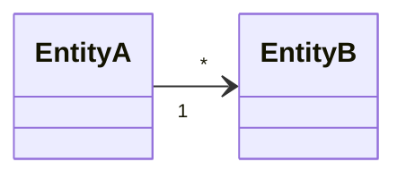

# Entities — core

Entities shared by every craft: **one file per entity**, `specs/core/entities/<Name>.md` (T2, 7.0).
An entity belonging to one craft lives in `specs/<craft>/entities/<Name>.md`. Whichever entities a
UC "uses" are context for that UC (`context.sh` prints the whole entity file the UC names; the DoR
gate checks the state diagram inside it).

File name = the entity name in the code and in the glossary (`WorkItem.md` ↔ `- **Work item** (`WorkItem`)`).
Skeleton for one entity: the plugin's `templates/skel/entity.md` — `/sdd-solo:start` copies it when a
UC names an entity that has no file yet.

## Domain Model
<How the core entities relate. Not an ERD — names and relations only; fields and states live in each
entity's own file.>

## Boundary rule
A file in `specs/core/` **cites no craft's IDs** (RULE/ADR/UC/BR under `specs/<craft>/`).
Core knows nothing of a craft; a craft knows core. `layer-check.sh` checks it; the githook
`pre-commit.d/20-layer-boundary` blocks when enabled.
