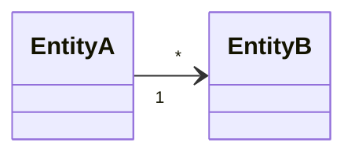

# Entities — core

Entity dùng chung cho mọi nghề: **mỗi entity một file** `specs/core/entities/<Tên>.md` (T2, 7.0).
Entity riêng một nghề nằm ở `specs/<nghề>/entities/<Tên>.md`. Một UC "dùng" entity nào thì file
đó là bối cảnh của UC (`context.sh` in nguyên file entity mà UC nhắc tên; cổng DoR kiểm state
diagram trong đó).

Tên file = tên entity trong code và trong glossary (`WorkItem.md` ↔ `- **Việc** (`WorkItem`)`).
Khuôn một entity: `templates/skel/entity.md` của plugin — `/sdd-solo:start` copy khi UC nhắc
một entity chưa có file.

## Domain Model
<Quan hệ giữa các entity core. Không phải ERD — chỉ tên và quan hệ; trường và trạng thái nằm
trong file từng entity.>

## Luật ranh giới
File trong `specs/core/` **không trích ID của nghề nào** (RULE/ADR/UC/BR của `specs/<nghề>/`).
Lõi không biết nghề; nghề biết lõi. `layer-check.sh` kiểm; githook `pre-commit.d/20-layer-boundary`
chặn khi bật.
