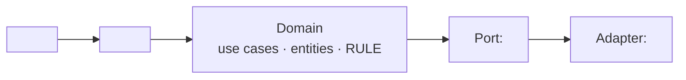

# Architecture — hiến pháp kỹ thuật của dự án

**Status:** draft
**Last updated:** ___

> Bốn tầng yêu cầu (BR · UC · Entity · AC) trả lời *vì sao · ai làm gì · khái niệm nào ·
> biết đúng bằng cách nào*. **Không tầng nào trả lời *dựng bằng gì · chạy ở đâu · ai gọi*.**
> File này là ngăn đó. Nó viết MỘT lần cho cả dự án và sửa khi có ADR đụng tới;
> `design.md` của mỗi UC phải đối chiếu ngược lên đây.
>
> Ca thật đẻ ra file này: một UC đi trọn vòng, qua cổng DoR, rồi bản thiết kế viết ra
> một kiến trúc **ngược hẳn** brief — và không ai thấy trong hai ngày, vì mỗi tài liệu
> tự nó nhất quán. Chỗ hỏng không phải một phép kiểm đo sai; là **một vùng không phép
> kiểm nào được giao nhìn tới**.
>
> `design-check.sh` đỏ khi file này còn `<...>`. Chưa quyết được thì viết `___` **kèm một
> dòng trong `## Open Questions` của BR** — `___` là câu trả lời hợp lệ, `<...>` thì không.

## Ngăn xếp
<ngôn ngữ · runtime · thư viện xương sống. Kèm LÝ DO — "vì đang quen" là một lý do thật,
cứ ghi thẳng thế; thứ không được phép là để trống rồi mỗi UC tự chọn một kiểu.>

## Nơi chạy
<máy khách · server mình dựng · CI · máy của khách. Và: dữ liệu nhạy cảm nằm ở đâu khi
đang chạy, ai đọc được nó.>

<!-- Giá trị của mục này KHÔNG phải "bắt mâu thuẫn" — đừng đi tìm mâu thuẫn. Giá trị là
     BUỘC PHẢI VIẾT CHỖ NỐI RA. Mâu thuẫn giả thì tan ngay khi viết; mâu thuẫn thật thì
     không tan. Cả hai kết cục đều là thu hoạch, và không ai biết trước sẽ ra cái nào.

     Ca thật (runxops). Hai câu, đọc rời thì như chọi nhau:
       CON-002  "phần chạm eBay bắt buộc chạy ở máy có Multilogin"
       ADR-001  "server không bao giờ chạm ổ đĩa khách"
     Viết vào cùng một mục mới thấy chúng nói về HAI CHỦ THỂ khác nhau — một câu nói việc
     thủ công của NGƯỜI làm ở đâu, câu kia nói CODE chạy ở đâu. Mâu thuẫn tan.
     Không có mục này thì mâu thuẫn giả đó sống tới lúc ai đó ở bước ⑪ tự giải theo cách
     của họ, trong im lặng. -->

## Ai gọi
<người gõ lệnh · lịch chạy · hệ khác gọi vào · agent. Một cái tên cụ thể, không phải "người dùng".>

## Ranh giới
<domain không được biết gì; adapter được biết gì. Vẽ luôn cho dễ đối chiếu:>

## Cấm
<những thứ dự án này KHÔNG làm, kèm lý do. Đây là mục hay bị bỏ trống nhất và là mục đắt
nhất: một điều cấm không viết ra thì sáu tháng sau không ai phân biệt được "chưa làm" với
"cố ý không làm".>

**Dòng nào nêu nguồn thì phải trích nguyên văn**, dạng:

- không <việc bị cấm> — nguồn: `BR-001` · nguyên văn: "<chép đúng chữ trong nguồn>" — vì <lý do>

<!-- Vì sao bắt chép nguyên văn thay vì chỉ ghi ID (ca thật, runxops). Một dòng ở đây viết:
       "Không tự động hoá chạy TRONG phiên Multilogin. BR-001 Out of Scope: đã thử, rủi ro chết acc"
     BR-001 thật ra cấm chạy NGOÀI phiên; còn In Scope của nó thì CHO PHÉP chạy trong.
     Tức dòng đó vừa ĐẢO NGHĨA một điều cấm, vừa dán nguồn cho câu mà nguồn không nói.

     Nó đọc rất trôi chảy. Nó ngồi trong br.md từ đầu, qua br-check xanh, qua adversarial
     ba vai, qua cổng DoR — không phép kiểm nào bắt được, vì KHÔNG PHÉP KIỂM NÀO ĐỌC BRIEF
     VÀ BR CÙNG LÚC. `design-check` cũng không bắt được: nó kiểm ID CÓ TỒN TẠI, không kiểm
     ID CÓ NÓI ĐÚNG THỨ ĐANG GẮN NÓ, và `BR-001` thì có thật.

     Thứ làm nó lộ ra là ĐỘNG TÁC CHÉP NGUYÊN VĂN: đi lấy đúng câu về dán vào đây thì thấy
     ngay nó nói "ngoài" chứ không nói "trong". `design-check` cảnh báo (không chặn) khi
     một dòng nêu ID mà không có "nguyên văn:".

     Và ca đó còn dạy thêm một điều: sửa xong mới lộ ra nó KHÔNG phải lỗi chép — đó là HAI
     điều cấm từ hai thời điểm, cái sau ngặt hơn và nuốt luôn thứ In Scope đang cho phép.
     Cho nên khi hai nguồn đá nhau, đừng chọn hộ: ghi cả hai vào đây, thêm một dòng
     ## Open Questions, để chủ dự án quyết. -->

## Đã chốt từ brief
<Đích đến của mọi dòng `→ chuyển: architecture.md` trong `## Đã loại khỏi brief` của
`specs/br.md`. Mỗi dòng: brief nói gì · ở đây quyết thế nào · nếu khác brief thì VÌ SAO.
Trống mục này trong khi br.md có dòng trỏ tới đây nghĩa là hàng đã gửi mà chưa ai nhận.>
