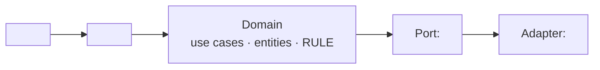

# Architecture — hiến pháp kỹ thuật của dự án

**Status:** draft
**Last updated:** ___

> Bốn tầng yêu cầu (BR · UC · Entity · AC) trả lời *vì sao · ai làm gì · khái niệm nào ·
> biết đúng bằng cách nào*. **Không tầng nào trả lời *dựng bằng gì · chạy ở đâu · ai gọi*.**
> File này là ngăn đó. Nó viết MỘT lần cho cả dự án và sửa khi có ADR đụng tới;
> `design.md` của mỗi UC phải đối chiếu ngược lên đây.
>
> Ca thật đẻ ra file này: một UC đi trọn vòng, qua cổng DoR, rồi bản thiết kế viết ra
> một kiến trúc **ngược hẳn** brief — và không ai thấy trong hai ngày, vì mỗi tài liệu
> tự nó nhất quán. Chỗ hỏng không phải một phép kiểm đo sai; là **một vùng không phép
> kiểm nào được giao nhìn tới**.
>
> `design-check.sh` đỏ khi file này còn `<...>`. Chưa quyết được thì viết `___` **kèm một
> dòng trong `## Open Questions` của BR** — `___` là câu trả lời hợp lệ, `<...>` thì không.

## Ngăn xếp
<ngôn ngữ · runtime · thư viện xương sống. Kèm LÝ DO — "vì đang quen" là một lý do thật,
cứ ghi thẳng thế; thứ không được phép là để trống rồi mỗi UC tự chọn một kiểu.>

## Nơi chạy
<máy khách · server mình dựng · CI · máy của khách. Và: dữ liệu nhạy cảm nằm ở đâu khi
đang chạy, ai đọc được nó.>

## Ai gọi
<người gõ lệnh · lịch chạy · hệ khác gọi vào · agent. Một cái tên cụ thể, không phải "người dùng".>

## Ranh giới
<domain không được biết gì; adapter được biết gì. Vẽ luôn cho dễ đối chiếu:>

## Cấm
<những thứ dự án này KHÔNG làm, kèm lý do và ADR nếu có. Đây là mục hay bị bỏ trống nhất
và là mục đắt nhất: một điều cấm không viết ra thì sáu tháng sau không ai phân biệt được
"chưa làm" với "cố ý không làm".>

## Đã chốt từ brief
<Đích đến của mọi dòng `→ chuyển: architecture.md` trong `## Đã loại khỏi brief` của
`specs/br.md`. Mỗi dòng: brief nói gì · ở đây quyết thế nào · nếu khác brief thì VÌ SAO.
Trống mục này trong khi br.md có dòng trỏ tới đây nghĩa là hàng đã gửi mà chưa ai nhận.>
