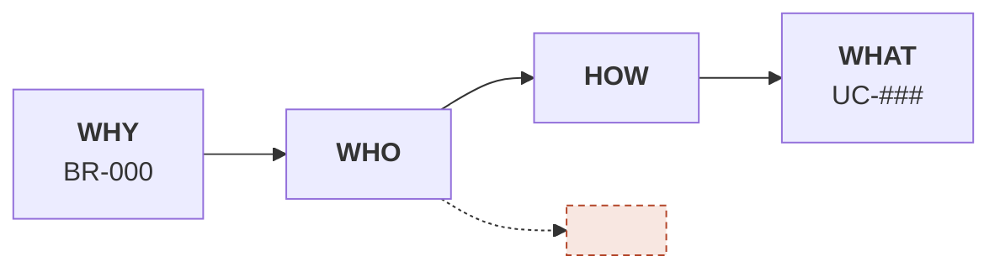

# BR-000: <Business requirement name>

<!-- Skeleton for one slice. /sdd-solo:intake copies it to specs/<core|craft>/br-###/br.md and
     renumbers BR-000 to the next number in the whole project (one BR sequence across all
     crafts, never restarted). -->

## Metadata
- **Status:** draft | approved | in-progress | done
- **Slice:** <core | craft> · <slice name exactly as in the `## Crafts and slices` table of specs/vision.md>
- **Source:** interview (/sdd-solo:intake) | brief `<path>` | written directly
<!-- Converted from a brief? Add the line below (as an aside, not a bullet) and set
     `brief_path=` in .sdd/config. That puts the brief into the required reading order of
     every later session, and lets br-check tell whether the brief changed since it was loaded. -->
**Brief source:** <path> · sha256 <first 12 hex> · loaded <YYYY-MM-DD>
- **Target release:** v___
- **Last updated:** YYYY-MM-DD

## Background
<Why this requirement exists — business context, customer feedback, outside constraints.
Any claim without a number or a source belongs in Open Questions, not written here as fact.>

**Why still build:** <which non-software options were weighed, and why they were dropped. If none
were weighed, write "no reason yet" — that is the honest answer, and the sceptic role will push
on exactly this spot.>

## Goal
<One sentence. Avoid "optimise", "improve", "enhance" while Success Metrics has no number.>

## Success Metrics
- <Metric 1>: ___ → ___   (measured by: <how it is really measured, hand-counting included> · baseline month ___)
- <Metric 2>: ___          (measured by: <how it is really measured>)

## In Scope (v___)
- ...

## Out of Scope
- <Deliberately not doing — each line should be a branch on the Impact Map that does not reach the Goal> → slice ___ | → reopen when ___

<!-- Every line says where it GOES. A line that repeats something in `## Do not narrow` of
     specs/vision.md makes br-check red — unless it says `deliberately narrowed — owner decided YYYY-MM-DD`. -->

<!-- The section below exists ONLY when the BR was converted from a brief. Written from an
     interview? Delete it — nothing was dropped, so there is nothing to record. -->
## Dropped from brief
- <item in the brief> — <why it is not in the spec> → slice ___ | → reopen when ___
- <item deferred to the design layer> — <why> → moved to: <architecture.md · ADR-### · CHG-### · Open Question>

<!-- Deferring without a destination is deferring into nothing: no mechanism carries the item
     there by itself. Every line needs one: `→ slice ___` (which slice in vision.md picks it up)
     or `→ reopen when ___` (the condition) — br-check goes red without it (7.0). The destination
     of a deferred architecture item is specs/architecture.md, section ## Settled from brief.
     Real case: "the whole architecture — belongs to the design layer" sat here for two days
     while plan.md was written with an architecture that CONTRADICTED the brief. br-check warns
     when a deferred line has no '→ moved to:'. -->

## Related Use Cases
| UC | Name | Actor | BR | Status |
|---|---|---|---|---|
| UC-### | ... | ... | BR-000 | draft |

## Constraints
- **CON-001 Technical:** ...
  - From: YYYY-MM-DD · Known via: <who said it · where it was measured · which regulation> · Review on: <a date or an event> · State: holds
- **CON-002 Regulatory:** ...
  - From: YYYY-MM-DD · Known via: ... · Review on: ... · State: holds
- **CON-003 Timing/SLA:** ...
  - From: YYYY-MM-DD · Known via: ... · Review on: ... · State: holds

## Impact Map

## Adversarial pass
<`/sdd-solo:adversarial BR-000` fills this in — three roles: the one who pays, the one who operates it forever, the sceptic>

## Open Questions
- [ ] ...

## History
- v1 (YYYY-MM-DD): initial
