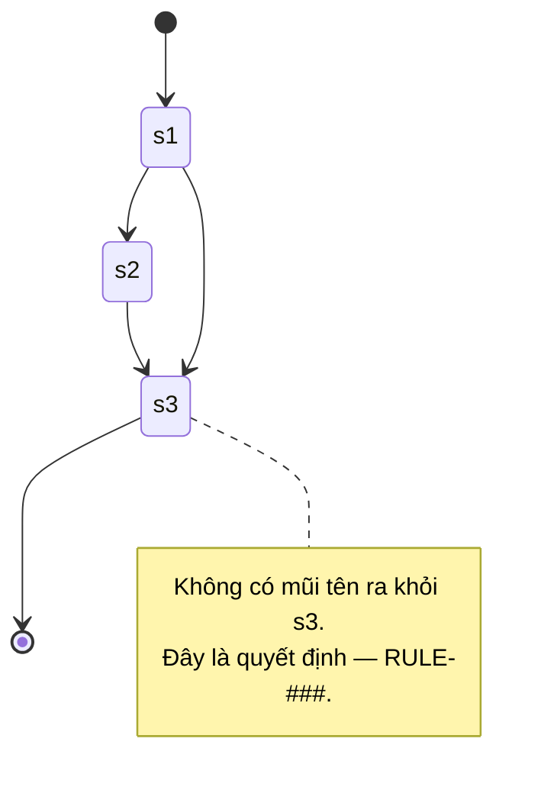

# EntityA

<!-- Một entity một file (7.0, T2). Tên file = tên entity trong code = tên trong glossary.
     Không phải ERD: chỉ ý nghĩa, trường đáng chú ý, quan hệ, trạng thái. -->

- **Đại diện:** <một câu>
- **Thuộc:** core | <nghề>
- **Trường đáng chú ý:** `fieldTwo` — giá trị theo RULE-###, không phải default.
- **Quan hệ:** EntityA "1" --> "*" EntityB : <quan hệ>
- **Trạng thái:** s1 → s2 → s3 (state diagram dưới; không có `status` thì bỏ mục này)

Mỗi mũi tên ghi **nguyên nhân** kéo nó. Thường là một `UC-###`; nhưng trạng thái đổi vì thế giới
bên ngoài (sàn khoá tài khoản, hết hạn theo đồng hồ, hệ thống khác đẩy sang) thì ghi đúng nguyên
nhân đó — **đừng dán một `UC-###` giả lên cho đủ hình thức**. Cổng DoR chỉ đòi ít nhất một mũi tên
gắn UC có thật trong các file entity UC nhắc tên.

## History
- v1 (YYYY-MM-DD): initial
