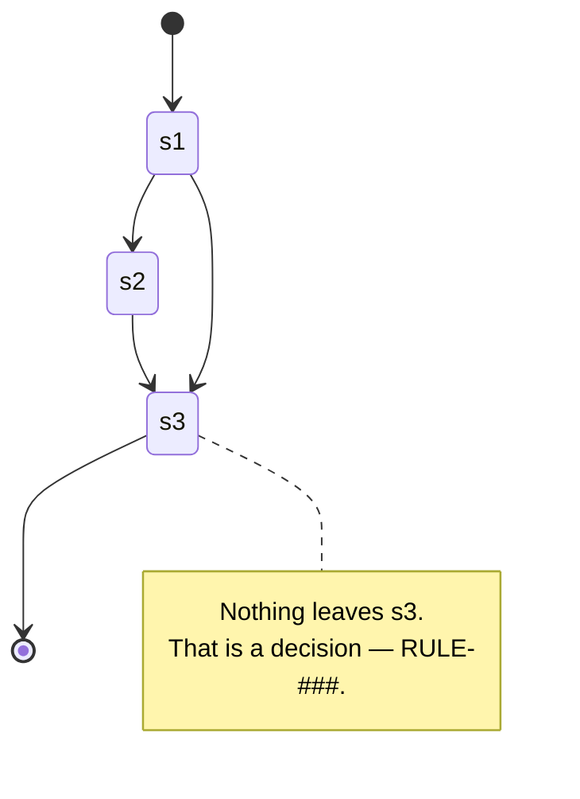

# EntityA

<!-- One entity, one file (7.0, T2). File name = entity name in the code = name in the glossary.
     Not an ERD: only meaning, the fields worth noting, relations, states. -->

- **Represents:** <one sentence>
- **Belongs to:** core | <craft>
- **Fields worth noting:** `fieldTwo` — value comes from RULE-###, not from a default.
- **Relations:** EntityA "1" --> "*" EntityB : <relation>
- **State:** s1 → s2 → s3 (state diagram below; drop this line when there is no `status`)

Every arrow names **what pulls it**. Usually a `UC-###`; but when a state changes because of the
outside world (the marketplace locks the account, a clock expires it, another system pushes it),
name that cause — **do not paste a fake `UC-###` on it to look complete**. The DoR gate only asks
for at least one arrow carrying a UC that really exists, across the entity files the UC names.

## History
- v1 (YYYY-MM-DD): initial
