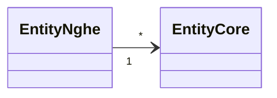

# Entities — <nghề>

Entity chỉ nghề này dùng, **mỗi entity một file** `<Tên>.md` (khuôn: `templates/skel/entity.md`).
Entity dùng chung mọi nghề nằm ở `specs/core/entities/`. Nghề được trích entity core; core không
biết entity của nghề.

## Domain Model

