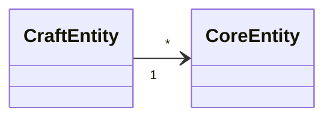

# Entities — <craft>

Entities only this craft uses, **one file per entity** `<Name>.md` (skeleton:
`templates/skel/entity.md`). Entities shared by every craft live in `specs/core/entities/`.
A craft may cite a core entity; core knows nothing about a craft's entities.

## Domain Model

