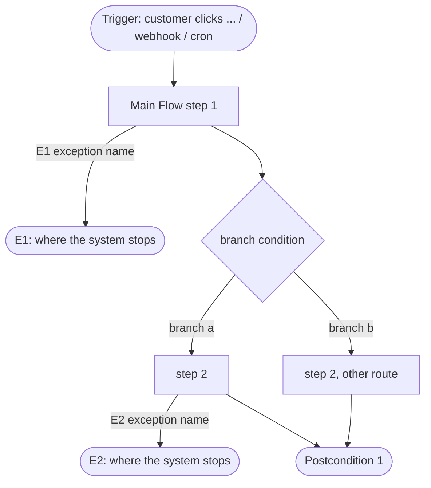

# UC-000 — Flow

The use case as a diagram. To look at it: VS Code `Cmd+Shift+V`, or open the file on GitHub. Nothing to install.

Conventions — the DoR gate checks the first two **mechanically**:

- Every exception declared in `## Exceptions` of the UC must appear here as an **edge label** — the part **between the two `|`**: `-->|E1 exception name|`. Missing one means an exception whose path was never drawn.
- Every exception label here must exist in `## Exceptions`. Do not label an ID that does not exist yet.
- **Only labels between two `|` are counted.** Node names do not count, even when they contain `E#` — so writing the end node as `X1([E1: ...])` is for the reader, not for passing the gate.
- Name end nodes `P#` for a normal end and `X#` for the end of an exception. An id shaped `E<digits>` can no longer fake a label, but it still reads badly, so the gate will say so.

Check before the DoR gate:

| In the UC | In the diagram |
|---|---|
| Actor | `subgraph <actor name>` — only needed with two or more actors |
| Trigger | first node `S([...])`; write the trigger kind into the name |
| each Main Flow step | one `T#[...]` |
| each Alternative Flow | a branch of `D#{...}`, condition on the edge |
| each Exception | an edge `\|E# ...\|` leading to `X#([E#: ...])` |
| each Postcondition | one end node `P#([...])` |

When several steps lead to the same Postcondition, point them at one node — do not duplicate the end node.
