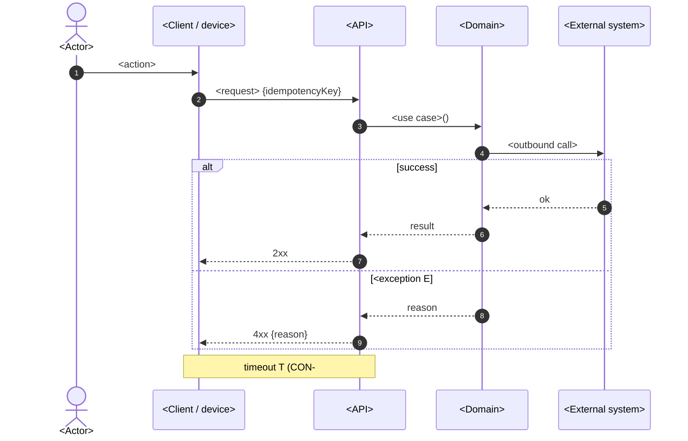

# UC-000 — Sequence

Only create this when the UC crosses a network boundary or talks to an external system. Draw timeout, retry, idempotency — the things the flowchart in `UC-000.flow.md` does not say clearly.

