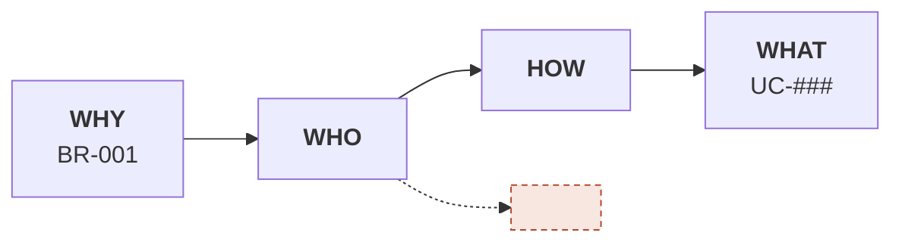

# BR-001: Bán hàng không rơi đơn

<!-- Khuôn một lát. /sdd-solo:intake copy vào specs/<core|nghề>/br-###/br.md và đổi BR-001 → số kế tiếp
     trong cả dự án (một dãy BR cho mọi nghề, không đánh lại). -->

## Metadata
- **Status:** draft | approved | in-progress | done
- **Lát:** orders · lát 1 "báo đơn"
- **Nguồn:** phỏng vấn (/sdd-solo:intake) | brief `<đường/dẫn>` | tự viết
<!-- Chuyển từ brief thì thêm dòng dưới (ngoài lề, không phải gạch đầu dòng) và
     khai `brief_path=` trong .sdd/config. Nó đưa brief vào thứ tự đọc bắt buộc
     của session sau, và cho br-check biết brief đã đổi kể từ lần nạp hay chưa. -->
**Nguồn brief:** <đường/dẫn> · sha256 <12 hex đầu> · nạp <YYYY-MM-DD>
- **Target release:** v___
- **Last updated:** YYYY-MM-DD

## Background
<Vì sao có requirement này — bối cảnh kinh doanh, phản hồi khách, ràng buộc bên ngoài.
Khẳng định nào không có số hoặc nguồn thì đưa xuống Open Questions, đừng viết ở đây như sự thật>

**Vì sao vẫn xây:** <đã cân những cách không-phần-mềm nào, bỏ vì sao. Chưa cân cái nào thì ghi
thẳng "chưa có lý do" — đó là câu trả lời trung thực, và vai hoài nghi sẽ bấu vào đúng chỗ này>

## Goal
<Một câu. Tránh "tối ưu", "cải thiện", "nâng cao" nếu Success Metrics chưa có số>

## Success Metrics
- <Metric 1>: ___ → ___   (đo qua: <cách đo thật, kể cả đếm tay> · baseline tháng ___)
- <Metric 2>: ___          (đo qua: <cách đo thật>)

## In Scope (v___)
- ...

## Out of Scope
- <Những thứ cố ý không làm — mỗi dòng nên là một nhánh trên Impact Map không nối về Goal> → lát ___ | → mở lại khi ___

<!-- Mỗi dòng nói nó đi ĐÂU. Dòng trùng một điều ở `## Không thu hẹp` của specs/vision.md thì
     br-check đỏ — trừ khi ghi `cố ý thu hẹp — chủ dự án chốt YYYY-MM-DD`. -->

<!-- Mục dưới CHỈ có khi BR chuyển từ brief. Viết từ phỏng vấn thì xoá đi —
     không loại cái gì khỏi brief thì không có gì để ghi. -->
## Đã loại khỏi brief
- <mục trong brief> — <lý do không đưa vào spec> → lát ___ | → mở lại khi ___
- <mục hoãn sang tầng thiết kế> — <lý do> → chuyển: <architecture.md · ADR-### · CHG-### · Open Question>

<!-- Hoãn mà không ghi ĐÍCH là hoãn vào hư không: không cơ chế nào tự mang mục đó
     tới đó. Mỗi dòng phải có đích: `→ lát ___` (lát nào trong vision.md sẽ nhận) hoặc
     `→ mở lại khi ___` (điều kiện) — br-check đỏ khi thiếu (7.0). Đích của một mục kiến trúc bị
     hoãn là specs/architecture.md,
     mục ## Đã chốt từ brief. Ca thật: "toàn bộ kiến trúc — thuộc tầng thiết kế" nằm ở đây hai
     ngày trong khi plan.md được viết với kiến trúc NGƯỢC LẠI brief. br-check
     cảnh báo khi dòng hoãn thiếu '→ chuyển:'. -->

## Related Use Cases
| UC | Tên | Actor | BR | Status |
|---|---|---|---|---|
| UC-001 | Báo đơn mới | Seller | BR-001 | draft |

## Constraints
- **CON-001 Technical:** ...
  - Từ: YYYY-MM-DD · Biết qua: <ai nói · đo ở đâu · điều luật nào> · Kiểm lại: <mốc hoặc sự kiện> · Trạng thái: đúng
- **CON-002 Regulatory:** ...
  - Từ: YYYY-MM-DD · Biết qua: ... · Kiểm lại: ... · Trạng thái: đúng
- **CON-003 Timing/SLA:** ...
  - Từ: YYYY-MM-DD · Biết qua: ... · Kiểm lại: ... · Trạng thái: đúng

## Impact Map

## Adversarial pass
<`/sdd-solo:adversarial BR-001` điền vào đây — ba vai: người trả tiền, người vận hành mãi, người hoài nghi>

## Open Questions
- [ ] ...

## History
- v1 (YYYY-MM-DD): initial
